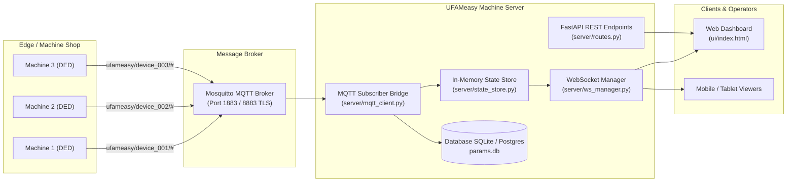
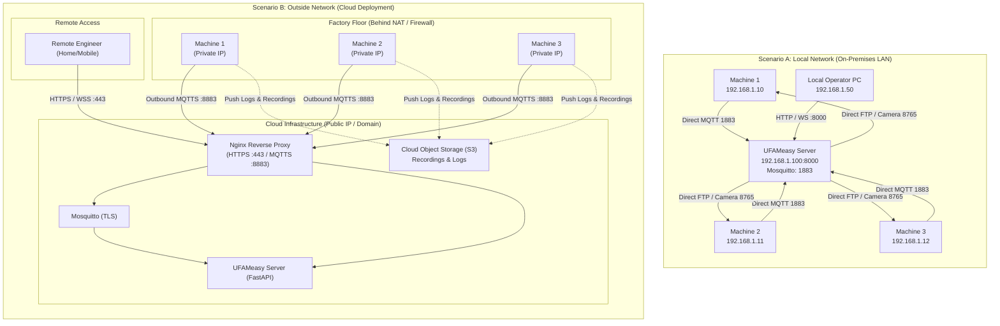

# Technical Report: UFAMeasy Machine Server Multi-Machine Scaling, Networking & Cloud Deployment

---

## 1. Executive Summary & System Overview

The **UFAMeasy Machine Server** is an Industrial Internet of Things (IIoT) backend and real-time monitoring dashboard tailored for **5-axis Directed Energy Deposition (DED) / Laser Additive Manufacturing** systems. 

The server bridges physical manufacturing hardware (laser heads, powder feeders, inert gas regulators, motion controllers) and CAD/CAM software (FreeCAD UFAMeasy Workbench) with web-based operational monitoring interfaces.

### Core Technology Stack
- **Ingestion Protocol:** MQTT (Mosquitto Broker) for low-latency, event-driven, decoupled telemetry.
- **Backend Application:** Python 3.13+ with **FastAPI** and **Uvicorn** (asynchronous event loop).
- **In-Memory Cache:** Python-native thread-safe `StateStore` (lock-protected parameter & slice snapshot cache).
- **Relational Persistence:** SQLite database (`data/params.db`) recording device registries, manufacturing sessions, slice metadata, and high-frequency runtime logs.
- **Real-Time Client Streaming:** Asynchronous WebSockets (`/ws`) broadcasting state deltas to connected browser clients.
- **Frontend Dashboard:** Vanilla JavaScript single-page application (zero build-step dependency), supporting live G-code tracking, multi-axis positions, sensor gauges, and video/log inspection.



---

## 2. Multi-Machine Handling Architecture (Example: 3 Machines)

When scaling from a single workshop machine to multiple industrial cells (e.g., **Machine 1: `device_001`**, **Machine 2: `device_002`**, and **Machine 3: `device_003`**), the server handles routing, isolation, storage, and presentation through clear architectural boundaries.

### 2.1 Device Identification & MQTT Topic Namespacing

Every machine runs its own instance of the UFAMeasy FreeCAD client or controller agent. Each machine is assigned a unique identifier (`device_id`). The server organizes message streams using hierarchical MQTT topics:

```
ufameasy/{device_id}/{subtopic}
```

#### Example Topic Distribution for 3 Machines:
| Topic | Machine 1 (`device_001`) | Machine 2 (`device_002`) | Machine 3 (`device_003`) |
|---|---|---|---|
| **Session Start** | `ufameasy/device_001/session/start` | `ufameasy/device_002/session/start` | `ufameasy/device_003/session/start` |
| **Runtime Telemetry** | `ufameasy/device_001/runtime` | `ufameasy/device_002/runtime` | `ufameasy/device_003/runtime` |
| **Axis Positions** | `ufameasy/device_001/runtime/position`| `ufameasy/device_002/runtime/position`| `ufameasy/device_003/runtime/position`|
| **Slice Snapshot** | `ufameasy/device_001/slice/{n}` | `ufameasy/device_002/slice/{n}` | `ufameasy/device_003/slice/{n}` |
| **Estimate Request** | `ufameasy/device_001/estimate/request` | `ufameasy/device_002/estimate/request` | `ufameasy/device_003/estimate/request` |
| **Session End** | `ufameasy/device_001/session/end` | `ufameasy/device_002/session/end` | `ufameasy/device_003/session/end` |

#### Ingestion Routing in `server/mqtt_client.py`:
The server subscribes once to wildcard topic `ufameasy/#`. Upon receiving a packet:
1. It splits the topic by `/`: `topic_parts = msg.topic.split("/")`.
2. Extract `device_id = topic_parts[1]`.
3. Validates whether `device_001`, `device_002`, or `device_003` is publishing.
4. Updates device-specific state structures without cross-talk or race conditions.

```python
# Multi-machine topic router snippet from mqtt_client.py
if len(topic_parts) >= 3 and topic_parts[0] == "ufameasy":
    device_id = topic_parts[1]
    subtopic = topic_parts[2:]
    
    if subtopic == ["runtime"]:
        # Updates only this device's memory partition and database records
        state.update_parameter(device_id, key, value)
        _broadcast({"type": "runtime_update", "device_id": device_id, "data": data})
```

---

### 2.2 Data Partitioning & Storage Isolation

To prevent telemetry collision between concurrent prints:

1. **In-Memory State Store (`server/state_store.py`):**
   - In-memory dictionaries are partitioned by `device_id`:
     ```python
     self.parameters = {
         "device_001": {"laser_power": 850.0, "gas_enabled": 1, "current_layer": 42},
         "device_002": {"laser_power": 0.0,   "gas_enabled": 0, "current_layer": 0},
         "device_003": {"laser_power": 1100.5,"gas_enabled": 1, "current_layer": 118}
     }
     ```
   - Thread locks ensure atomic reads and updates when all 3 machines stream simultaneously.

2. **Database Schema Isolation (`server/db.py`):**
   - **`devices` Table:** Registers `device_id`, human-readable name, and `last_seen` heartbeat timestamp.
   - **`sessions` Table:** Every print run generates a unique `session_id` tied to `device_id` as a foreign key:
     ```sql
     CREATE TABLE sessions (
         session_id TEXT PRIMARY KEY,
         device_id TEXT REFERENCES devices(device_id),
         file_name TEXT,
         total_layers INT,
         status TEXT,
         started_at TEXT,
         ended_at TEXT
     );
     ```
   - **`runtime_log` & `slice_data`:** Indexed strictly by `session_id`. Queries for Machine 1 never scan or interfere with data belonging to Machine 2 or Machine 3.

---

### 2.3 Dashboard Experience with 3 Machines

In the frontend UI (`ui/index.html`):
1. **Device Switcher:** A dropdown selector (`<select id="deviceSelect">`) populates all known devices via `GET /devices`.
2. **Dynamic Data Scoping:**
   - When an operator selects **Machine 2 (`device_002`)**, the dashboard loads:
     - Active session and current G-code file for Machine 2.
     - Live 5-axis coordinates ($X, Y, Z, A, C$) for Machine 2.
     - Process parameter gauges (Laser Wattage, Powder Feed Rate, Shielding Gas Flow).
     - Camera stream matching Machine 2's IP/Port.
3. **Selective WebSocket Ingestion:**
   - The `/ws` channel sends tagged messages: `{ "type": "runtime_update", "device_id": "device_001", "data": {...} }`.
   - The UI evaluates `if (msg.device_id === deviceSelect.value)` before triggering DOM redraws. Background machines update badge indicators (e.g. green "RUNNING", yellow "IDLE", red "ALARM") without disrupting the current focused view.

---

## 3. Network Architecture: Within Network (LAN) vs. Outside Network (WAN/Cloud)

Handling 3 machines depends heavily on where the server sits relative to the physical machines.



### 3.1 Scenario A: Within the Local Network (LAN)

In an on-premises setup, Machine 1, Machine 2, Machine 3, and the Machine Server reside on the same workshop subnet (e.g. `192.168.1.0/24`).

* **Connection Mechanism:**
  - Machines connect to Mosquitto at `192.168.1.100:1883` over plain TCP.
  - The server accesses Machine FTP servers (port `2121`) to fetch `.u5log` / `.csv` diagnostic logs directly.
  - The server probes camera endpoints at `http://192.168.1.10:8765/status` to stream MJPEG feeds into the dashboard.
* **Pros:**
  - Zero cloud hosting costs.
  - Sub-millisecond latency for high-rate position updates (10–50 Hz).
  - High video bandwidth available without ISP data cap limitations.
  - Works completely offline without an internet connection.
* **Cons:**
  - Cannot monitor production remotely without physical presence or complex on-prem VPN router configurations.
  - Server hardware must be maintained and backed up on-site.

---

### 3.2 Scenario B: Outside Network (Cloud Deployment)

When the server is moved to a Cloud provider (e.g., AWS, DigitalOcean, Azure), physical machines are located in a factory behind a standard NAT router/firewall with private IP addresses (e.g., `192.168.1.x`), while the server has a public domain/IP.

#### The Core Cloud Networking Challenge: Inbound vs. Outbound Connections
1. **MQTT Telemetry Works Out of the Box:**
   - MQTT is an **outbound** protocol.
   - Machine 1, 2, and 3 initiate an outbound connection to `mqtt.yourcompany.com:8883`.
   - Factory firewalls permit outbound traffic by default. The persistent TCP socket allows bi-directional communication with no port forwarding required on the factory router.
2. **Direct FTP & Camera Checks Fail Without Architectural Adjustment:**
   - In the current local code (`server/routes.py`), the server initiates connections **into** machine IPs:
     ```python
     # This works on LAN, but FAILS from Cloud to Factory!
     ftp.connect(machine_ip, port=2121)
     socket.create_connection((machine_ip, 8765))
     ```
   - A cloud server **cannot directly dial** `192.168.1.10` inside your workshop because private IPs are non-routable over the public Internet.

#### The 3 Solutions for Cloud Architecture:

| Architecture Pattern | How It Solves Cloud Connectivity | Recommended For |
|---|---|---|
| **Pattern 1: Reverse Push to Cloud (Best Practice)** | Machines do not run FTP servers. Instead, when a print completes or a camera recording finishes, the machine makes an **HTTP POST** to `https://server.com/api/recordings/upload` or writes to an **AWS S3** bucket. | Modern, secure cloud production. No VPN required. |
| **Pattern 2: Industrial Mesh VPN (e.g., Tailscale / WireGuard)** | Install lightweight Tailscale/WireGuard clients on Machine 1, 2, 3, and the Cloud Server. All nodes receive secure virtual private IPs (e.g. `100.64.0.x`). | Fastest migration without rewriting existing FTP/Camera routes. |
| **Pattern 3: Edge Streaming Gateway (MediaMTX / WebRTC)** | Camera feeds are pushed by machines via RTSP/WebRTC to a cloud media relay rather than pulled on demand. | Smooth, low-latency live camera streaming to multiple viewers. |

---

## 4. Security Requirements for Cloud Deployment

To deploy UFAMeasy Machine Server safely on the public internet:

1. **TLS / SSL Encryption:**
   - Encrypt MQTT on port **8883** using TLS (MQTTS).
   - Encrypt REST API and WebSockets on port **443** using HTTPS and WSS via an **Nginx** reverse proxy and automated **Let's Encrypt** certificates.
2. **MQTT Authentication & Access Control (ACL):**
   - Disable anonymous MQTT access.
   - Assign dedicated MQTT credentials per device:
     - `device_001_user` has write permissions only to `ufameasy/device_001/#`.
     - `device_002_user` has write permissions only to `ufameasy/device_002/#`.
     - `server_backend` has subscription permissions to `ufameasy/#`.
   - This ensures a compromised machine cannot spoof or eavesdrop on another machine's print parameters.
3. **API & Dashboard Authentication:**
   - Add JWT or session token authentication to FastAPI routes and WebSocket handshakes (`/ws?token=...`).
4. **Database Engine Upgrade:**
   - While SQLite is suitable for a single machine on local disk, concurrent writes from 3+ high-frequency machines over network filesystems can cause `sqlite3.OperationalError: database is locked`.
   - Migrate to **PostgreSQL** (managed RDS or containerized) for production multi-machine concurrency.

---

## 5. Estimated Cloud Deployment Costs

The following cost model breaks down the infrastructure required to support **3 to 10 industrial machines** streaming real-time telemetry, session logs, and camera monitoring.

### 5.1 Cost Components Breakdown

1. **Compute (Cloud Server / VPS):**
   - Runs FastAPI (Uvicorn), Mosquitto MQTT Broker, and Nginx.
   - Recommended specs: 2 vCPU, 4 GB RAM, 50–80 GB NVMe SSD.
2. **Database:**
   - Option A: Embedded SQLite on local SSD (Lowest cost, $0 additional).
   - Option B: Managed PostgreSQL (High reliability, automatic backups).
3. **Object Storage (Recordings & Diagnostic Logs):**
   - Storing `.csv` logs, `.u5log` dumps, and video clips (e.g., AWS S3, Cloudflare R2, or DigitalOcean Spaces).
   - Estimated usage: ~50–100 GB/month.
4. **Bandwidth & Data Egress:**
   - Telemetry JSON messages are small (~200 bytes at 5 Hz = ~1 KB/s per machine $\approx$ 2.6 GB/month for 3 machines).
   - Live camera streaming: If operators watch 1 Mbps MJPEG video for 2 hours daily across 3 machines: ~80 GB/month.
5. **Domain & SSL:**
   - Domain name ($10–$15/year) + Free SSL via Let's Encrypt ($0).

---

### 5.2 Deployment Tier Comparison & Monthly Costs

All prices are in **USD ($)** based on current cloud industry pricing (AWS, DigitalOcean, Hetzner, Cloudflare):

| Cost Category | Tier 1: Small / Pilot Setup<br>*(Single VPS / Droplet)* | Tier 2: Standard Production<br>*(VPS + S3 Storage + Backups)* | Tier 3: Enterprise Cloud<br>*(AWS Managed Services)* |
|---|---|---|---|
| **Target Setup** | 3 Machines (Testing/R&D) | 3–10 Machines (Factory Floor) | 10+ Machines (High Availability) |
| **Compute Instance** | **$12 - $18 / mo**<br>(DigitalOcean Droplet or Hetzner 2 vCPU / 4GB RAM) | **$24 - $28 / mo**<br>(DigitalOcean 2 vCPU / 4GB RAM or AWS Lightsail) | **$70 - $95 / mo**<br>(AWS EC2 `t4g.medium` or ECS Fargate) |
| **Database** | **$0** (SQLite on local NVMe SSD) | **$15 / mo**<br>(Managed PostgreSQL or automated snapshot storage) | **$60 - $80 / mo**<br>(AWS RDS PostgreSQL Multi-AZ `db.t4g.small`) |
| **MQTT Broker** | **$0** (Self-hosted Mosquitto on same VPS) | **$0** (Self-hosted Mosquitto container with TLS) | **$25 - $40 / mo**<br>(AWS IoT Core message broker or dedicated EMQX) |
| **Object Storage**<br>*(Recordings/Logs)* | **$0** (Local disk storage) | **$5 / mo**<br>(Cloudflare R2 or DO Spaces, 250 GB storage) | **$15 - $25 / mo**<br>(AWS S3 Standard + Lifecycle archiving) |
| **Bandwidth / Egress** | **$0** (Included in VPS 2–4 TB quota) | **$0 - $5 / mo** (Within quota) | **$10 - $20 / mo** (AWS data transfer fees) |
| **Domain & SSL** | **$1 / mo** (~$12/year domain, SSL free) | **$1 / mo** (~$12/year domain, SSL free) | **$1 / mo** |
| **Total Monthly Cost** | **\$13 – \$19 / month** | **\$45 – \$54 / month** | **\$180 – \$260 / month** |
| **Total Annual Cost** | **~\$150 – \$230 / year** | **~\$540 – \$650 / year** | **~\$2,160 – \$3,120 / year** |

---

### 5.3 Recommended Strategy for UFAMeasy

> [!TIP]
> **Start with Tier 2 (Standard Production on a single cloud VPS with Object Storage):**
> 1. Provision a **DigitalOcean Droplet** or **AWS Lightsail** instance (2 vCPU, 4 GB RAM, 80 GB SSD) for **\$20–\$24/month**.
> 2. Run **Mosquitto MQTT** on port 8883 with TLS certificates and **FastAPI** behind **Nginx**.
> 3. Use **Cloudflare R2** or **AWS S3** (\$5/mo) for storing print recordings and diagnostic logs (Cloudflare R2 has **$0 data egress fees**, making video playback essentially free).
> 4. Connect workshop machines using **Tailscale** (free for up to 100 devices) or direct MQTTS.
> **Total operational cost: approximately \$25 – \$35 / month.**

---

## 6. Multi-Machine Readiness Checklist

To execute this architecture smoothly, review the following steps:

1. [ ] **Hardware Parameter Namespacing:** Ensure each UFAMeasy FreeCAD client workstation sets a unique identifier in its local config (`device_001`, `device_002`, `device_003`).
2. [ ] **Broker Security:** Configure Mosquitto with `password_file` and ACL rules to prevent unauthorized topic tampering.
3. [ ] **Firewall Ports on Cloud VPS:**
   - Open Port `443` (HTTPS / WSS for dashboard).
   - Open Port `8883` (MQTTS for machine telemetry).
   - Keep Port `8000` and Port `1883` closed to the public Internet (bound to localhost only).
4. [ ] **Video & Log Sync:** Implement an HTTP POST upload endpoint for camera video snippets and FTP `.u5log` files so machines push files to the cloud rather than relying on the cloud server dialing local factory IPs.
5. [ ] **Database Migration (Optional for >5 machines):** Transition `server/db.py` from SQLite to PostgreSQL using an async driver (e.g. `asyncpg` or SQLAlchemy).

---
*Report compiled for UFAMeasy Machine Server Architecture Planning.*
